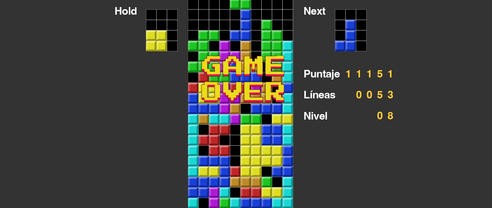

# TETRIZADO (nombre provisorio)

## Equipo de desarrollo

- Ezequiel Giannoni
- Mateo Pirchi
- Fausto Rodriguez
- Lucas Cerutti
  
## IDEA PRINCIPAL DE JUEGO
El juego se basa en un tetris. Nos inspiramos en el tetris oficial y buscamos imitar su funcionamiento.

## Capturas

## Reglas de Juego / Instrucciones
- Tecla UP: rotar bloque en sentido horario
- Tecla Z: rotar bloque en sentido antihorario
- Tecla DOWN: descender bloque una posision
- Tecla LEFT: mover bloque a la izquierda
- Tecla RIGHT: mover bloque a la derecha
- Tecla SPACE: hard drop (enviar el bloque al fondo)
- Tecla P: pausa y reanudar
- Tecla R: restart

## Otros

- K2005/UTN-FRBA
- Versión de wollok 0.2.7
- Repositorio puede ser público
